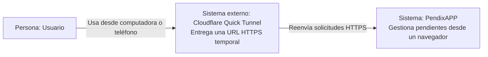
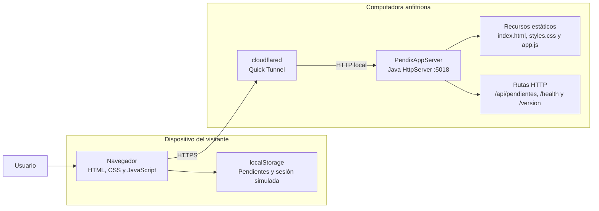
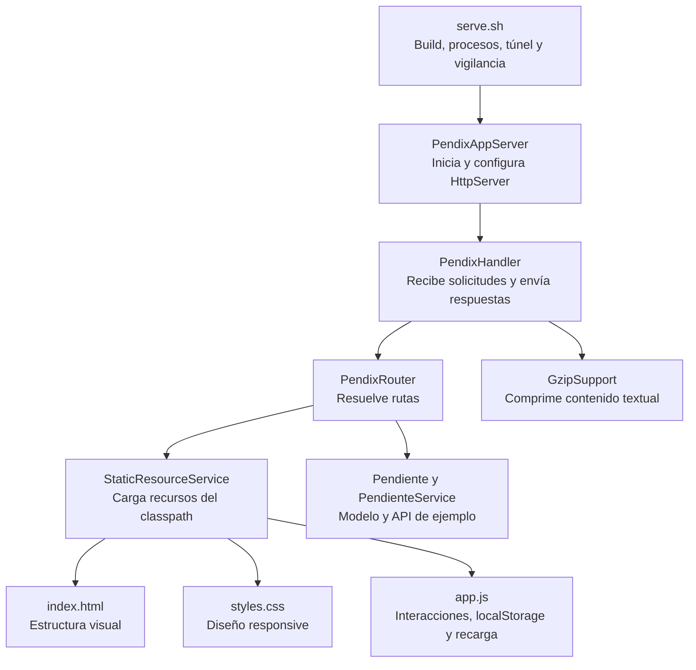

# Modelo C4 — PendixAPP

## C4 Nivel 1 — Contexto

## C4 Nivel 2 — Contenedores

## C4 Nivel 3 — Componentes

## Nota de persistencia

PendixAPP no utiliza una base de datos compartida. La interfaz guarda pendientes y sesión simulada en `localStorage`, por lo que cada navegador conserva información independiente.
