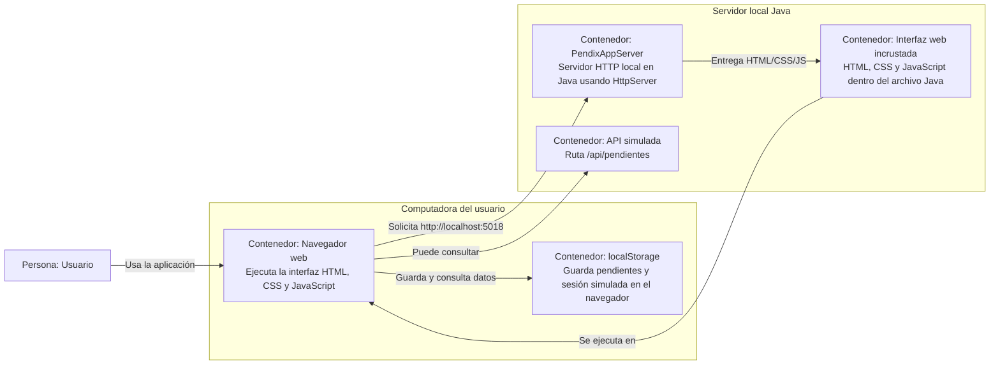

## C4 Nivel 2 — Contenedores

**Para quién es:**  
Este nivel está dirigido a personas con conocimientos técnicos básicos, ya que muestra las piezas principales del sistema y cómo se comunican.

**Qué pregunta responde:**  
¿Cuáles son las partes grandes de PendixAPP y cómo interactúan entre sí?

