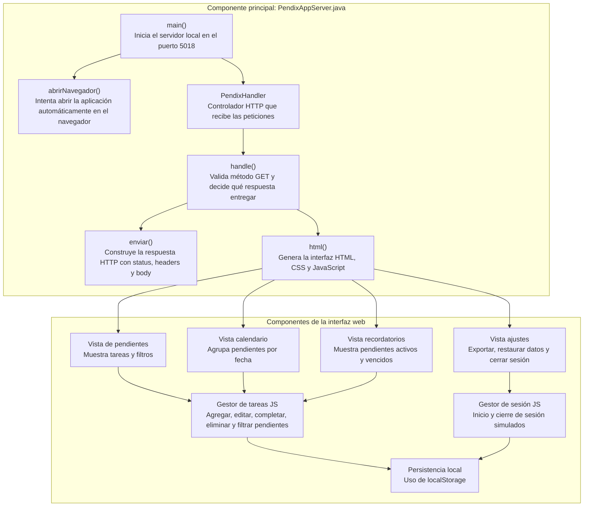

# Modelo C4 — PendixAPP

## C4 Nivel 1 — Contexto

**Para quién es:**  
Este nivel está dirigido a personas no técnicas, docentes o compañeros que necesitan entender de forma general qué es PendixAPP y quién lo utiliza.

**Qué pregunta responde:**  
¿Quién usa el sistema y cuál es el propósito principal de PendixAPP?

```mermaid
flowchart LR
    Usuario["Persona: Usuario<br/>Estudiante o persona que necesita organizar pendientes"]
    PendixAPP["Sistema: PendixAPP<br/>Prototipo web local para gestionar pendientes, recordatorios, calendario, planes e inicio de sesión simulado"]
    Navegador["Navegador web<br/>Medio donde se visualiza la aplicación"]

    Usuario -->|"Registra, consulta, modifica y elimina pendientes"| PendixAPP
    PendixAPP -->|"Se muestra mediante"| Navegador


## C4 Nivel 2 — Contenedores

**Para quién es:**  
Este nivel está dirigido a personas con conocimientos técnicos básicos, ya que muestra las piezas principales del sistema y cómo se comunican.

**Qué pregunta responde:**  
¿Cuáles son las partes grandes de PendixAPP y cómo interactúan entre sí?

```mermaid
flowchart LR
    Usuario["Persona: Usuario"]

    subgraph Dispositivo["Computadora del usuario"]
        Navegador["Contenedor: Navegador web<br/>Ejecuta la interfaz HTML, CSS y JavaScript"]
        LocalStorage["Contenedor: localStorage<br/>Guarda pendientes y sesión simulada en el navegador"]
    end

    subgraph ServidorLocal["Servidor local Java"]
        JavaServer["Contenedor: PendixAppServer<br/>Servidor HTTP local en Java usando HttpServer"]
        HtmlApp["Contenedor: Interfaz web incrustada<br/>HTML, CSS y JavaScript dentro del archivo Java"]
        ApiSimulada["Contenedor: API simulada<br/>Ruta /api/pendientes"]
    end

    Usuario -->|"Usa la aplicación"| Navegador
    Navegador -->|"Solicita http://localhost:5018"| JavaServer
    JavaServer -->|"Entrega HTML/CSS/JS"| HtmlApp
    HtmlApp -->|"Se ejecuta en"| Navegador
    Navegador -->|"Guarda y consulta datos"| LocalStorage
    Navegador -->|"Puede consultar"| ApiSimulada
```


## C4 Nivel 3 — Componentes

**Para quién es:**  
Este nivel está dirigido a desarrolladores o revisores técnicos que necesitan entender qué componentes existen dentro de la pieza principal del sistema.

**Qué pregunta responde:**  
¿Qué componentes internos forman PendixAPP y qué responsabilidad tiene cada uno?



### Nota técnica del Nivel 3

PendixAPP concentra la lógica principal en el archivo `PendixAppServer.java`.  
El servidor Java funciona como punto de entrada de la aplicación, mientras que `PendixHandler` actúa como controlador HTTP simple.  
La interfaz, las vistas y la lógica de interacción se encuentran incrustadas dentro del método `html()`, usando HTML, CSS y JavaScript.  
La persistencia no usa base de datos externa, sino almacenamiento local del navegador mediante `localStorage`.
