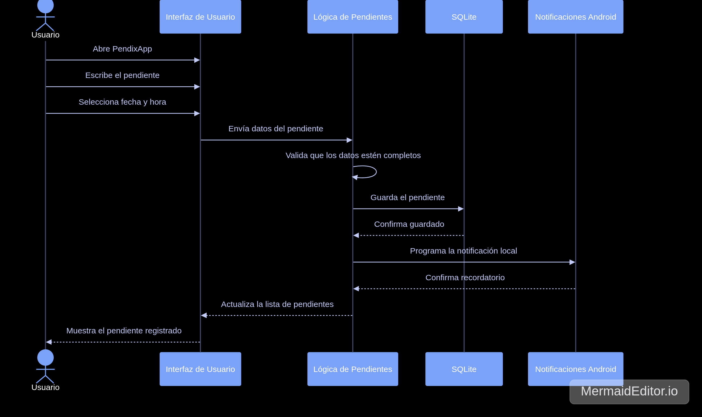

# PendixApp - ADR-06: Incorporación de API REST

PendixApp es una aplicación móvil enfocada en la gestión de pendientes y recordatorios personales.  
El objetivo del sistema es permitir que el usuario registre tareas, asigne fechas y horarios, consulte sus pendientes, marque actividades como completadas y reciba recordatorios desde un dispositivo Android.

En esta rama se documenta el **ADR-06**, donde se toma la decisión de incorporar una **API REST** al proyecto para exponer las funciones principales de PendixApp mediante endpoints.

---

## Datos del Estudiante

| Campo | Información |
| :--- | :--- |
| **Nombre** | Angel Abraham Lugo Saenz |
| **Matrícula** | SW2409052 |
| **Materia** | Arquitectura de Software |
| **Profesor** | Jorge Javier Pedroza Romero |
| **Proyecto** | PendixApp |
| **Tarea** | ADR-06: Incorporación de API REST |
| **Fecha** | 19/06/2026 |
| **Estado** | APROBADO |

---

## Descripción General

PendixApp es una aplicación pensada para ayudar a organizar tareas personales desde el celular.

En su primera versión, la aplicación funciona principalmente de manera local, permitiendo crear pendientes, asignar fechas, consultar actividades, marcarlas como completadas y recibir recordatorios desde el dispositivo Android.

Con este ADR se agrega la decisión de incorporar una **API REST**, para que las funciones principales del sistema puedan exponerse mediante endpoints y el proyecto tenga una estructura más cercana a una aplicación profesional.

La API no reemplaza la aplicación móvil, sino que funciona como una extensión del sistema.  
La app Android puede seguir existiendo como cliente, mientras que la API se encarga de administrar los datos de los pendientes de forma más ordenada.

---

## Objetivo de esta Rama

El objetivo de esta rama es documentar la incorporación de una API REST para PendixApp.

Esta rama explica:

```text
- Por qué se decidió agregar una API REST.
- Qué problema resuelve dentro del proyecto.
- Qué endpoints principales se proponen.
- Por qué se eligió REST.
- Qué alternativas fueron consideradas.
- Qué consecuencias tiene agregar un backend al sistema.
- Cómo se relaciona la API con PendixApp.
```

Esto permite entender que PendixApp ya no se plantea únicamente como una app local, sino como un sistema que puede crecer y conectarse con otros clientes o servicios en el futuro.

---

## Archivos de la Rama

En esta rama deben aparecer únicamente los archivos relacionados con el ADR-06 y sus diagramas:

```text
Proyecto_ArqSoft/
│
├── ADR-06_Angel_Lugo.md
├── C4_Angel_Lugo.png
├── mermaid-diagram-1780715733924.png
└── README.md
```

---

## Tecnologías y Elementos Utilizados

| Elemento | Uso dentro del proyecto |
| :--- | :--- |
| **ASP.NET Core Web API** | Desarrollo de la API REST |
| **C#** | Lenguaje utilizado para el backend |
| **Swagger** | Documentación y prueba visual de endpoints |
| **REST** | Estilo para exponer operaciones mediante HTTP |
| **Java** | Lenguaje considerado para la aplicación Android |
| **Android SDK** | Herramientas para la app móvil |
| **SQLite** | Almacenamiento local en la primera versión |
| **Firebase** | Posible sincronización futura |
| **Markdown** | Documentación del ADR y README |
| **Git y GitHub** | Control de versiones y entrega del proyecto |

---

## Decisión Principal del ADR-06

La decisión principal del ADR-06 es incorporar una **API REST** utilizando **ASP.NET Core Web API**.

Esta API estará enfocada en la administración de pendientes de PendixApp.

La decisión se tomó porque el proyecto necesita una forma más ordenada y profesional de exponer sus funciones principales, como consultar, crear, editar, completar y eliminar pendientes.

---

## ¿Qué problema resuelve la API REST?

La API REST resuelve el problema de tener toda la lógica de los pendientes únicamente dentro de la aplicación móvil.

Al agregar una API, las funciones principales del sistema pueden quedar disponibles mediante endpoints.  
Esto permite que PendixApp tenga una base más preparada para crecer.

También ayuda a documentar mejor el sistema, porque con Swagger se puede visualizar qué endpoints existen, qué datos reciben y qué respuestas entregan.

Además, prepara el proyecto para futuras mejoras como:

```text
- Sincronización de datos.
- Conexión con una base de datos externa.
- Consumo desde diferentes clientes.
- Integración con una aplicación web.
- Separación entre frontend y backend.
```

---

## ¿Por qué se eligió REST?

Se eligió REST porque se adapta bien a las operaciones principales de PendixApp.

El sistema necesita realizar acciones como:

```text
- Crear pendientes.
- Consultar pendientes.
- Actualizar pendientes.
- Marcar pendientes como completados.
- Eliminar pendientes.
```

Estas acciones se pueden representar de forma sencilla usando métodos HTTP como:

```text
GET
POST
PUT
PATCH
DELETE
```

REST también es una opción adecuada porque es fácil de entender, fácil de probar y muy utilizada en el desarrollo de APIs.

Para el alcance actual del proyecto, permite implementar una solución funcional sin agregar una complejidad innecesaria.

---

## Endpoints Principales

Los endpoints propuestos para la API REST son:

| Método | Endpoint | Descripción |
| :--- | :--- | :--- |
| **GET** | `/api/pendientes` | Obtener todos los pendientes registrados |
| **GET** | `/api/pendientes/{id}` | Obtener un pendiente específico por su ID |
| **POST** | `/api/pendientes` | Crear un nuevo pendiente |
| **PUT** | `/api/pendientes/{id}` | Actualizar la información de un pendiente |
| **PATCH** | `/api/pendientes/{id}/completar` | Marcar un pendiente como completado |
| **DELETE** | `/api/pendientes/{id}` | Eliminar un pendiente |

Estos endpoints representan las operaciones básicas que PendixApp necesita para administrar pendientes.

---

## Organización General de la API

La API puede organizarse de forma sencilla separando controladores, modelos y lógica del sistema.

Ejemplo de estructura:

```text
PendixApp.Api/
│
├── Controllers/
│   └── PendientesController.cs
│
├── Models/
│   └── Pendiente.cs
│
├── Services/
│   └── PendienteService.cs
│
├── Data/
│   └── PendixDbContext.cs
│
├── Program.cs
└── appsettings.json
```

Esta estructura ayuda a evitar que todo el código quede mezclado y permite ubicar mejor cada parte del backend.

---

## Funcionamiento General

El flujo general de la API sería el siguiente:

```text
Cliente Android o navegador
        ↓
Endpoint de la API
        ↓
Controlador
        ↓
Servicio o lógica de pendientes
        ↓
Almacenamiento de datos
        ↓
Respuesta HTTP
```

De esta forma, PendixApp puede consultar o modificar pendientes mediante solicitudes HTTP.

---

## Relación entre PendixApp y la API

La aplicación Android puede seguir funcionando como cliente.

La API REST se encarga de exponer las operaciones principales del sistema mediante endpoints.

```text
PendixApp Android
        ↓
API REST
        ↓
Datos de pendientes
```

Esto permite que, en el futuro, otros clientes también puedan consumir la misma API.

Por ejemplo:

```text
- Aplicación móvil Android.
- Aplicación web.
- Panel administrativo.
- Cliente de pruebas desde Swagger.
```

---

## Swagger

Swagger se utilizará para documentar y probar los endpoints desde el navegador.

Esto permite revisar la API de manera más clara, sin tener que probar todos los endpoints únicamente desde código o desde herramientas externas.

Con Swagger se puede:

```text
- Ver los endpoints disponibles.
- Revisar los métodos HTTP.
- Probar solicitudes.
- Consultar respuestas.
- Validar que la API funcione correctamente.
```

---

## Alternativas Consideradas

| Alternativa | Motivo por el que no se eligió |
| :--- | :--- |
| **Mantener solo SQLite local** | Es más simple, pero no permite exponer las funciones mediante endpoints |
| **Firebase** | Puede servir para sincronización, pero agrega dependencia de un servicio externo |
| **GraphQL** | Es flexible, pero demasiado complejo para las necesidades actuales |
| **Microservicios** | No se justifica para una aplicación pequeña de pendientes personales |
| **Minimal API** | Es válida, pero se eligieron controladores para organizar mejor los endpoints |
| **No agregar backend** | Mantendría el proyecto más simple, pero limitaría su crecimiento futuro |

---

## Consecuencias de la Decisión

### Lo que se gana

Al incorporar una API REST, PendixApp queda mejor preparada para crecer.

Las funciones principales de los pendientes pueden exponerse mediante endpoints y esto permite que el sistema pueda ser consumido por diferentes clientes en el futuro.

También se obtiene una documentación más profesional con Swagger, lo que facilita probar y validar los endpoints.

### Consecuencia técnica

El proyecto deja de depender únicamente de la lógica local de la aplicación móvil.

Ahora se agrega un backend que puede organizar mejor las operaciones relacionadas con los pendientes.

Esto permite separar mejor la aplicación cliente de la administración de datos.

### Consecuencia sobre el proceso

La incorporación de una API REST acerca el proyecto a una forma de trabajo más parecida a la industria.

También permite practicar conceptos importantes como endpoints, métodos HTTP, controladores, modelos, respuestas y documentación de APIs.

---

## Lo que se sacrifica o asume

Agregar una API REST también aumenta la complejidad del proyecto.

Ahora no solo se debe pensar en la aplicación móvil, sino también en el backend.

Esto implica organizar correctamente:

```text
- Endpoints.
- Controladores.
- Modelos.
- Servicios.
- Validaciones.
- Respuestas HTTP.
- Documentación con Swagger.
```

Por ahora, la API se mantendrá con funciones básicas de pendientes.  
Características más avanzadas se dejan como mejoras futuras.

---

## Limitaciones y Riesgos

La principal limitación es que la API inicialmente se enfocará solo en funciones básicas.

No se contempla todavía una implementación completa de:

```text
- Autenticación de usuarios.
- Roles o permisos.
- Sincronización en tiempo real.
- Notificaciones desde servidor.
- Base de datos en la nube completamente integrada.
```

También existe el riesgo de que la API crezca de forma desordenada si no se mantiene una separación clara entre controladores, modelos y lógica.

---

## Diagrama de Vista de Procesos

El siguiente diagrama muestra el flujo principal cuando el usuario registra un pendiente en PendixApp.

Para que la imagen se muestre correctamente en GitHub, el archivo debe estar en la misma carpeta que este README.

```text
mermaid-diagram-1780715733924.png
```



---

## Diagrama C4 de PendixApp

El diagrama C4 permite representar PendixApp en dos niveles:

```text
- Nivel 1: Contexto del sistema.
- Nivel 2: Contenedores.
```

Este diagrama muestra la relación entre el usuario, PendixApp, el sistema de notificaciones de Android, SQLite y Firebase como posible servicio futuro.

```text
C4_Angel_Lugo.png
```


---

## Mejoras Futuras

```text
[ ] Implementar endpoints reales en ASP.NET Core Web API.
[ ] Configurar Swagger correctamente.
[ ] Agregar validaciones para los datos de los pendientes.
[ ] Conectar la API con una base de datos.
[ ] Agregar autenticación de usuarios.
[ ] Separar mejor controladores, modelos y servicios.
[ ] Permitir consumo desde la app Android.
[ ] Agregar sincronización en la nube.
[ ] Documentar respuestas y códigos HTTP.
[ ] Agregar pruebas básicas de los endpoints.
```

---

## Gestión con Git

Comandos básicos para subir únicamente el README de esta rama:

```bash
cd /home/avenkal/Descargas/Proyecto_ArqSoft
git branch --show-current
git status
git add README.md
git commit -m "Agrega README del ADR 06"
git push origin API
```

> Importante: no usar `git add .` si solo se quiere subir el README.

---

## Cómo Visualizar la Rama en GitHub

Para revisar correctamente esta documentación en GitHub:

```text
1. Entrar al repositorio Proyecto_ArqSoft.
2. Cambiar la rama de main a API.
3. Abrir el archivo README.md.
4. Verificar que se muestre el diagrama C4.
5. Verificar que se muestre el diagrama Mermaid de vista de procesos.
6. Abrir el archivo ADR-06_Angel_Lugo.md para revisar el ADR completo.
```

---

## Conclusión

En el ADR-06 se documenta la decisión de incorporar una API REST a PendixApp.

Esta decisión permite que el proyecto tenga una base más profesional, ya que las funciones principales de los pendientes pueden exponerse mediante endpoints.

Aunque agregar una API aumenta un poco la complejidad, también prepara el sistema para crecer, conectarse con otros clientes y organizar mejor la lógica de administración de pendientes.

Por ahora, la API se enfoca en operaciones básicas, pero puede evolucionar en el futuro con autenticación, base de datos externa, sincronización y consumo desde diferentes aplicaciones.

---

## Cláusula de IA

```text
Yo, Angel Abraham Lugo Saenz, declaro que utilicé IA como apoyo para organizar y redactar este README, así como para estructurar la explicación relacionada con el ADR-06 y la incorporación de una API REST en PendixApp.

El contenido principal, las decisiones del proyecto y la documentación del ADR fueron trabajados como parte de la actividad escolar de Arquitectura de Software.
```
