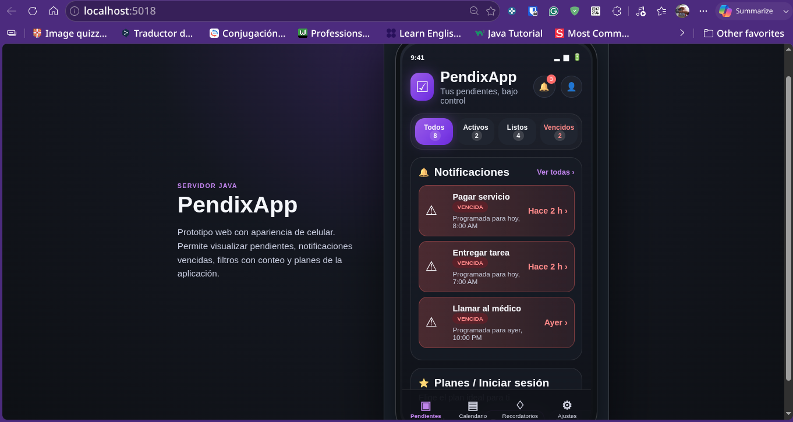

# PendixAPP - ADR-07: Patrones GOF

PendixAPP es una aplicación móvil enfocada en la gestión de pendientes y recordatorios personales.  
El sistema permite registrar tareas, asignar fechas y horarios, consultar pendientes, marcar actividades como completadas y recibir recordatorios desde un dispositivo Android.

En esta rama se documenta el **ADR-07**, donde se integran patrones de diseño **GOF** al proyecto para mejorar la organización interna del sistema sin hacerlo demasiado complejo.

---

## Evidencia de Ejecución Funcional

La siguiente imagen muestra el prototipo **PendixAPP** ejecutándose correctamente desde el navegador mediante un servidor local en Java usando el puerto `5018`.

En la captura se puede observar la interfaz tipo celular, el tema oscuro con tonos púrpuras, los filtros con conteo integrado, la sección de notificaciones vencidas y la sección de planes e inicio de sesión.

```text
URL de ejecución: http://localhost:5018
Servidor: Java
Puerto: 5018
```



---

## Datos del Estudiante

| Campo | Información |
| :--- | :--- |
| **Nombre** | Angel Abraham Lugo Saenz |
| **Matrícula** | SW2409052 |
| **Materia** | Arquitectura de Software |
| **Profesor** | Jorge Javier Pedroza Romero |
| **Proyecto** | PendixAPP |
| **Tarea** | Actividad #28 — Proyecto: Patrones GOF |
| **Fecha** | 26/06/2026 |
| **Estado** | ADR actualizado por ADR-07 |

---

## Descripción General

PendixAPP inició como una aplicación móvil Android para gestionar pendientes y recordatorios personales.

En avances anteriores, el sistema se planteó con almacenamiento local y después se incorporó una **API REST** para exponer las funciones principales del proyecto mediante endpoints.

La API permite administrar pendientes mediante operaciones como:

```text
- Consultar pendientes.
- Crear pendientes.
- Actualizar pendientes.
- Marcar pendientes como completados.
- Eliminar pendientes.
```

Con este nuevo ADR se agregan patrones de diseño GOF para que el sistema tenga una mejor organización interna, especialmente en la parte de la API y la lógica de pendientes.

---

## Objetivo de esta Rama

El objetivo de esta rama es documentar la integración de patrones de diseño GOF en PendixAPP.

Esta actividad pide integrar mínimo dos patrones GOF de categorías distintas.  
Por eso se eligieron patrones sencillos, reales y fáciles de implementar para un proyecto escolar de tercer cuatrimestre.

Esta rama explica:

```text
- Qué patrones GOF se eligieron.
- A qué categoría pertenece cada patrón.
- Qué problema resuelve cada patrón dentro de PendixAPP.
- Por qué se eligieron sobre otras opciones.
- Cómo se relacionan con la API REST.
- Qué consecuencias tiene integrarlos al proyecto.
```

---

## Archivos de la Rama

En esta rama deben aparecer únicamente los archivos relacionados con el ADR-07 y sus diagramas:

```text
Proyecto_ArqSoft/
│
├── ADR-07_GOF-Angel_Lugo.md
├── C4_Angel_Lugo.png
├── mermaid-diagram-1780715733924.png
├── Captura.png
└── README.md
```

---

## Patrones GOF Elegidos

Se decidió integrar dos patrones de diseño GOF:

| Patrón GOF | Categoría | Uso en PendixAPP |
| :--- | :--- | :--- |
| **Facade** | Estructural | Centralizar las operaciones principales de pendientes |
| **Strategy** | Comportamiento | Separar las formas de filtrar pendientes |

Estos patrones cumplen con la restricción de la actividad porque pertenecen a categorías distintas:

```text
Facade   -> Patrón estructural
Strategy -> Patrón de comportamiento
```

---

## ¿Por qué estos patrones?

Se eligieron **Facade** y **Strategy** porque son patrones fáciles de entender e implementar.

No se eligieron patrones demasiado complejos porque PendixAPP sigue siendo un proyecto escolar y el objetivo es aplicar patrones que realmente ayuden al sistema.

La idea no es agregar código innecesario, sino evitar que la lógica de pendientes quede mezclada dentro del controlador.

---

## Problema General

Al crecer PendixAPP con una API REST, existe el riesgo de que el controlador de pendientes concentre demasiada lógica.

Por ejemplo, un controlador podría terminar haciendo todo esto:

```text
- Recibir peticiones HTTP.
- Validar datos.
- Crear pendientes.
- Consultar pendientes.
- Actualizar pendientes.
- Marcar pendientes como completados.
- Eliminar pendientes.
- Filtrar pendientes.
- Decidir qué respuesta devolver.
```

Si todo queda dentro del controlador, el código se vuelve más difícil de leer, modificar y mantener.

Por eso se integran patrones GOF sencillos para separar responsabilidades.

---

## Patrón 1: Facade

### Categoría

```text
Estructural
```

### ¿Dónde se aplica?

El patrón **Facade** se aplicará en una clase de servicio llamada:

```text
PendienteFacade
```

Esta clase se encargará de centralizar las operaciones principales relacionadas con los pendientes.

El controlador ya no tendrá que manejar toda la lógica directamente.  
En su lugar, llamará a la fachada para realizar las acciones necesarias.

---

### Problema que resuelve

Facade resuelve el problema de tener controladores demasiado cargados.

Con este patrón, el controlador se enfoca en recibir la petición y devolver la respuesta, mientras que la fachada coordina las operaciones principales.

```text
PendientesController
        ↓
PendienteFacade
        ↓
Lógica de pendientes
```

---

### Métodos principales de la fachada

La clase `PendienteFacade` puede tener métodos como:

```text
- ObtenerPendientes()
- ObtenerPendientePorId(id)
- CrearPendiente(pendiente)
- ActualizarPendiente(id, pendiente)
- CompletarPendiente(id)
- EliminarPendiente(id)
```

Esto hace que el código sea más fácil de leer.

---

### Ejemplo sencillo

```csharp
public class PendienteFacade
{
    private readonly List<Pendiente> _pendientes;

    public PendienteFacade()
    {
        _pendientes = new List<Pendiente>();
    }

    public List<Pendiente> ObtenerPendientes()
    {
        return _pendientes;
    }

    public Pendiente CrearPendiente(Pendiente pendiente)
    {
        pendiente.Id = _pendientes.Count + 1;
        pendiente.Completado = false;
        _pendientes.Add(pendiente);
        return pendiente;
    }

    public bool CompletarPendiente(int id)
    {
        var pendiente = _pendientes.FirstOrDefault(p => p.Id == id);

        if (pendiente == null)
        {
            return false;
        }

        pendiente.Completado = true;
        return true;
    }
}
```

---

### ¿Por qué se eligió Facade?

Se eligió Facade porque ayuda a organizar el proyecto sin complicarlo demasiado.

También permite que, si después se cambia la forma de guardar los pendientes o se agregan más validaciones, el controlador no tenga que modificarse tanto.

Facade es adecuado para PendixAPP porque el sistema tiene varias operaciones relacionadas con pendientes y conviene agruparlas en una clase clara.

---

## Patrón 2: Strategy

### Categoría

```text
Comportamiento
```

### ¿Dónde se aplica?

El patrón **Strategy** se aplicará para manejar diferentes formas de filtrar pendientes.

PendixAPP puede necesitar mostrar:

```text
- Todos los pendientes.
- Pendientes activos.
- Pendientes completados.
- Pendientes vencidos.
```

En lugar de colocar muchos `if` o `switch` dentro del controlador, cada filtro puede manejarse como una estrategia separada.

---

### Problema que resuelve

Strategy resuelve el problema de tener demasiadas condiciones para filtrar pendientes.

Sin este patrón, el código podría crecer de esta forma:

```csharp
if (filtro == "todos")
{
    // mostrar todos
}
else if (filtro == "activos")
{
    // mostrar activos
}
else if (filtro == "completados")
{
    // mostrar completados
}
else if (filtro == "vencidos")
{
    // mostrar vencidos
}
```

Esto funciona al principio, pero si después se agregan más filtros, el código se vuelve más largo y difícil de mantener.

---

### Ejemplo sencillo

Primero se crea una interfaz:

```csharp
public interface IFiltroPendientesStrategy
{
    List<Pendiente> Filtrar(List<Pendiente> pendientes);
}
```

Después se crean estrategias concretas:

```csharp
public class FiltroCompletadosStrategy : IFiltroPendientesStrategy
{
    public List<Pendiente> Filtrar(List<Pendiente> pendientes)
    {
        return pendientes.Where(p => p.Completado).ToList();
    }
}
```

```csharp
public class FiltroActivosStrategy : IFiltroPendientesStrategy
{
    public List<Pendiente> Filtrar(List<Pendiente> pendientes)
    {
        return pendientes.Where(p => !p.Completado).ToList();
    }
}
```

---

### Posibles filtros en la API

Strategy puede usarse en endpoints como:

```text
GET /api/pendientes?filtro=todos
GET /api/pendientes?filtro=activos
GET /api/pendientes?filtro=completados
GET /api/pendientes?filtro=vencidos
```

Esto permite que los filtros crezcan sin llenar el controlador de condiciones.

---

### ¿Por qué se eligió Strategy?

Se eligió Strategy porque PendixAPP necesita consultar pendientes de diferentes formas.

Este patrón permite agregar nuevos filtros sin modificar demasiado el código existente.

También es fácil de entender, ya que cada clase representa una forma específica de filtrar la información.

---

## Relación con la API REST

La API REST de PendixAPP seguirá usando los endpoints principales:

| Método | Endpoint | Descripción |
| :--- | :--- | :--- |
| **GET** | `/api/pendientes` | Obtener todos los pendientes registrados |
| **GET** | `/api/pendientes/{id}` | Obtener un pendiente específico por su ID |
| **POST** | `/api/pendientes` | Crear un nuevo pendiente |
| **PUT** | `/api/pendientes/{id}` | Actualizar la información de un pendiente |
| **PATCH** | `/api/pendientes/{id}/completar` | Marcar un pendiente como completado |
| **DELETE** | `/api/pendientes/{id}` | Eliminar un pendiente |

Con los patrones GOF, la organización interna puede quedar así:

```text
PendientesController
        ↓
PendienteFacade
        ↓
IFiltroPendientesStrategy
        ↓
FiltroTodosStrategy
FiltroActivosStrategy
FiltroCompletadosStrategy
FiltroVencidosStrategy
```

---

## Estructura Propuesta del Proyecto

Una estructura sencilla para implementar estos patrones sería:

```text
PendixAPP.Api/
│
├── Controllers/
│   └── PendientesController.cs
│
├── Models/
│   └── Pendiente.cs
│
├── Facades/
│   └── PendienteFacade.cs
│
├── Strategies/
│   ├── IFiltroPendientesStrategy.cs
│   ├── FiltroTodosStrategy.cs
│   ├── FiltroActivosStrategy.cs
│   ├── FiltroCompletadosStrategy.cs
│   └── FiltroVencidosStrategy.cs
│
└── Program.cs
```

Esta estructura es sencilla y suficiente para el alcance actual del proyecto.

---

## Alternativas Consideradas

| Alternativa | Motivo por el que no se eligió |
| :--- | :--- |
| **Singleton** | ASP.NET Core ya maneja servicios mediante inyección de dependencias, por lo que usar Singleton manualmente puede complicar el proyecto |
| **Factory Method** | Se consideró para crear pendientes, pero la creación de objetos todavía es sencilla |
| **Observer** | Se consideró por las notificaciones, pero todavía no se necesita un sistema de eventos o suscriptores |
| **Decorator** | No se necesita agregar comportamiento dinámico a los pendientes por ahora |
| **Command** | Puede servir para acciones como crear o eliminar, pero es más complejo para este avance |
| **Repository** | Es útil, pero no es un patrón GOF, por lo que no cumple directamente con la actividad |

---

## Consecuencias de la Decisión

### Lo que se gana

Con **Facade**, el controlador queda más limpio porque no concentra toda la lógica del sistema.

Con **Strategy**, los filtros de pendientes quedan separados y pueden crecer de forma ordenada.

Ambos patrones ayudan a que PendixAPP tenga una estructura más clara y fácil de mantener.

---

### Consecuencia técnica

El proyecto tendrá más clases, pero cada una tendrá una responsabilidad más clara.

Esto facilita identificar:

```text
- Qué parte recibe las peticiones.
- Qué parte coordina las operaciones.
- Qué parte aplica los filtros.
```

También será más fácil agregar nuevos filtros en el futuro.

---

### Consecuencia sobre el proceso

Estos patrones son realistas para un proyecto escolar porque no obligan a rehacer todo el sistema.

Permiten avanzar con una solución sencilla, comprensible y útil para demostrar que PendixAPP empieza a tomar forma.

---

## Lo que se sacrifica o asume

Al integrar estos patrones, se agregan más archivos y clases al proyecto.

Esto puede parecer más trabajo al inicio, pero ayuda a evitar que el código crezca de forma desordenada.

También se asume que los patrones se implementarán de forma sencilla, sin intentar hacer una arquitectura demasiado avanzada.

---

## Diagrama de Vista de Procesos

El siguiente diagrama muestra el flujo principal cuando el usuario registra un pendiente en PendixAPP.

Para que la imagen se muestre correctamente en GitHub, el archivo debe estar en la misma carpeta que este README.

```text
mermaid-diagram-1780715733924.png
```


---

## Diagrama C4 de PendixAPP

El diagrama C4 permite representar PendixAPP en dos niveles:

```text
- Nivel 1: Contexto del sistema.
- Nivel 2: Contenedores.
```

Este diagrama muestra la relación entre el usuario, PendixAPP, el sistema de notificaciones de Android, SQLite y Firebase como posible servicio futuro.

```text
C4_Angel_Lugo.png
```


---

## Mejoras Futuras

```text
[ ] Implementar la clase PendienteFacade.
[ ] Crear la interfaz IFiltroPendientesStrategy.
[ ] Crear filtros para pendientes activos.
[ ] Crear filtros para pendientes completados.
[ ] Crear filtros para pendientes vencidos.
[ ] Conectar los filtros con el endpoint GET /api/pendientes.
[ ] Mantener los controladores con poca lógica.
[ ] Agregar pruebas simples de los filtros.
[ ] Documentar los endpoints en Swagger.
[ ] Evaluar nuevos patrones solo si el proyecto lo necesita.
```

---


## Ejecución del Prototipo Java

Además del ADR, se preparó una versión funcional del prototipo web de PendixAPP ejecutada con un servidor local en **Java**.

La finalidad de esta versión es mostrar visualmente cómo se vería la aplicación en un celular desde el navegador, respetando las decisiones documentadas en los ADR anteriores.

### Estructura de ejecución

```text
PendixAPP/
│
├── src/
│   └── PendixAppServer.java
│
├── public/
│   └── index.html
│
├── PendixApp.jar
├── iniciar_linux.sh
├── iniciar_mac.command
├── INICIAR_WINDOWS.bat
├── compilar_y_ejecutar_linux.sh
└── README_EJECUCION.md
```

### Cómo ejecutarlo

En Linux o Mac:

```bash
bash iniciar_linux.sh
```

O directamente con Java:

```bash
java -jar PendixApp.jar
```

Después se abre en el navegador:

```text
http://localhost:5018
```

### Qué muestra el prototipo

```text
- Interfaz tipo celular en el navegador.
- Gestión visual de pendientes.
- Filtros con conteo: Todos, Activos, Listos y Vencidos.
- Notificaciones vencidas.
- Sección de planes e inicio de sesión.
- Tema oscuro con colores púrpuras y violetas.
- Tareas completadas con opción de deshacer.
```

---

## Gestión con Git

Comandos básicos para subir únicamente el README de esta rama:

```bash
cd /home/avenkal/Descargas/Proyecto_ArqSoft
git switch GOF
git status
git add README.md
git commit -m "Agrega README del ADR GOF"
git push origin GOF
```

> Importante: no usar `git add .` si solo se quiere subir el README.

---

## Cómo Visualizar la Rama en GitHub

Para revisar correctamente esta documentación en GitHub:

```text
1. Entrar al repositorio Proyecto_ArqSoft.
2. Cambiar la rama de main a GOF.
3. Abrir el archivo README.md.
4. Verificar que se muestre el diagrama C4.
5. Verificar que se muestre el diagrama Mermaid.
6. Abrir el archivo ADR-07_GOF-Angel_Lugo.md para revisar el ADR completo.
```

---

## Conclusión

En el ADR-07 se documenta la integración de patrones GOF en PendixAPP.

Se eligieron los patrones **Facade** y **Strategy** porque son sencillos, pertenecen a categorías distintas y resuelven problemas reales dentro del sistema.

Facade ayuda a centralizar las operaciones principales de pendientes, mientras que Strategy permite separar las formas de filtrar información.

Con esta decisión, PendixAPP mantiene una estructura clara y fácil de implementar, adecuada para el alcance actual del proyecto y para una entrega escolar de tercer cuatrimestre.

---

## Cláusula de IA

```text
Yo, Angel Abraham Lugo Saenz, declaro que utilicé IA como apoyo para organizar y redactar este README, así como para estructurar la explicación relacionada con el ADR-07 y la integración de patrones GOF en PendixAPP.

El contenido principal, las decisiones del proyecto y la documentación del ADR fueron trabajados como parte de la actividad escolar de Arquitectura de Software.
```
