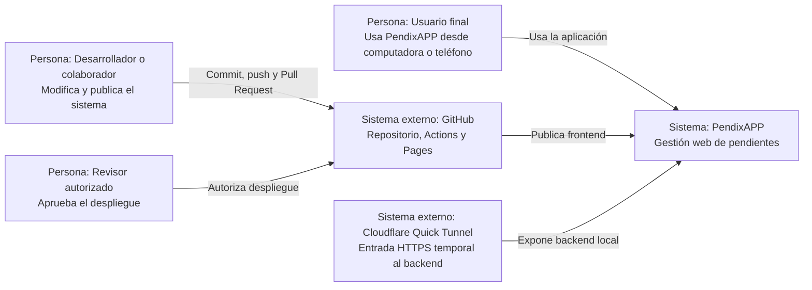
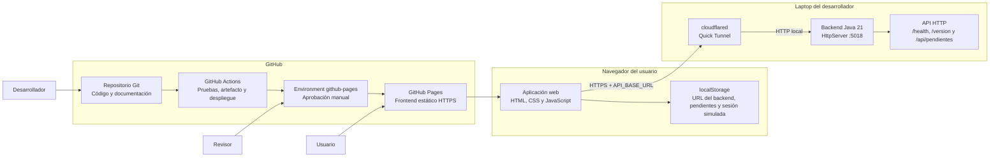
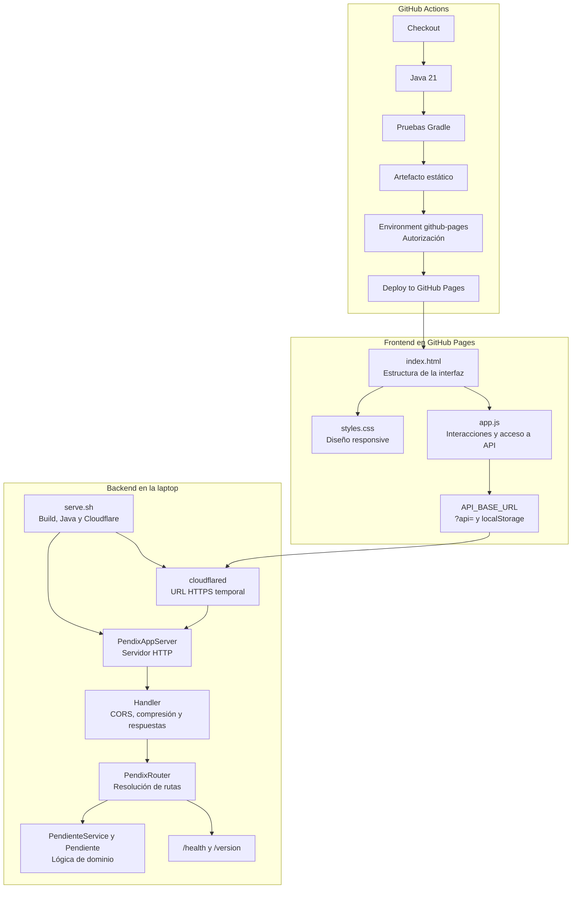

# ADR-10 — Arquitectura final de PendixAPP: frontend en GitHub Pages, backend local, Cloudflare Tunnel y CI/CD con aprobación

- **Estado:** Aceptado
- **Fecha:** 31 de julio de 2026
- **Rama evaluada:** `Entrega-Final`
- **Proyecto:** PendixAPP
- **URL del frontend:** `https://angel-lugo97.github.io/Proyecto_ArqSoft/`
- **Puerto local del backend:** `5018`

---

## 1. Contexto

PendixAPP se ejecutaba inicialmente como una sola aplicación Java que entregaba la interfaz web y atendía las solicitudes HTTP desde la misma computadora. Para la entrega final se necesitaba publicar la aplicación en internet sin utilizar AWS ni otro servicio de nube de pago, demostrar una separación entre frontend y backend, incorporar un pipeline visible en GitHub Actions, ejecutar pruebas automatizadas antes del despliegue y permitir una autorización manual antes de publicar una nueva versión.

GitHub Pages puede alojar archivos estáticos como HTML, CSS y JavaScript, pero no puede ejecutar un backend Java. Por esa razón, el frontend se publica en GitHub Pages y el backend continúa ejecutándose en la laptop del desarrollador.

Para permitir el acceso al backend desde otra red, se utiliza Cloudflare Quick Tunnel. El proceso `cloudflared` genera una URL HTTPS temporal de `trycloudflare.com` y redirige las solicitudes hacia el servidor Java local en `http://127.0.0.1:5018`.

La solución final también incluye una interfaz adaptable para computadora y teléfono, un script `serve.sh` para iniciar Java y Cloudflare, endpoints de diagnóstico, pruebas Gradle y un workflow de GitHub Actions para validar y desplegar el frontend.

> **Aclaración de persistencia:** actualmente la mayor parte de los pendientes y la sesión simulada continúan almacenándose en `localStorage`. Por ello, cada navegador mantiene sus propios datos. El backend Java todavía no funciona como una base de datos central compartida.

---

## 2. Problema arquitectónico

Se requiere una arquitectura que permita:

1. Publicar la interfaz en una URL pública permanente y gratuita.
2. Mantener el backend en la laptop del desarrollador.
3. Evitar servicios de infraestructura de pago.
4. Acceder al backend desde internet mediante HTTPS.
5. Separar físicamente frontend y backend.
6. Automatizar pruebas y despliegue.
7. Detener el despliegue hasta recibir autorización.
8. Mantener trazabilidad de cambios mediante Git y GitHub.
9. Permitir que la aplicación sea utilizable desde teléfonos.
10. Facilitar una demostración académica sin abrir puertos del router.

---

## 3. Fuerzas arquitectónicas

| Fuerza | Descripción |
|---|---|
| Costo | La solución debe funcionar sin AWS, tarjetas ni cargos recurrentes. |
| Desplegabilidad | El frontend debe poder actualizarse desde GitHub Actions. |
| Separación de responsabilidades | Frontend y backend deben poder ejecutarse y desplegarse por separado. |
| Disponibilidad | El frontend debe permanecer accesible aunque el backend esté apagado. |
| Seguridad de red | No se deben abrir puertos directamente en el router. |
| Trazabilidad | Los cambios deben quedar registrados en commits, Pull Requests y ejecuciones del pipeline. |
| Control de publicación | El despliegue debe poder quedar en espera hasta que un revisor lo autorice. |
| Compatibilidad móvil | La interfaz debe adaptarse correctamente a pantallas pequeñas. |
| Simplicidad | La solución debe ser comprensible y operable para una entrega académica. |

---

## 4. Decisión

Se decidió dividir PendixAPP en dos partes desplegadas de forma independiente.

### 4.1 Frontend

El frontend está compuesto por:

```text
index.html
styles.css
app.js
```

Los archivos estáticos se publican mediante GitHub Pages en:

```text
https://angel-lugo97.github.io/Proyecto_ArqSoft/
```

El frontend utiliza rutas relativas para que sus recursos funcionen dentro del subdirectorio del repositorio en GitHub Pages.

La interfaz incluye reglas responsive para:

- Eliminar el marco de teléfono simulado en pantallas pequeñas.
- Utilizar el ancho disponible del dispositivo.
- Ajustar filtros, formularios y tarjetas.
- Mantener botones con tamaño táctil adecuado.
- Adaptar la navegación inferior.
- Respetar áreas seguras del dispositivo.

### 4.2 Backend

El backend se ejecuta en la laptop mediante Java 21:

```text
http://127.0.0.1:5018
```

El servidor incluye, entre otros, los siguientes endpoints:

```text
GET /health
GET /version
GET /api/pendientes
```

El endpoint `/health` permite comprobar que el backend está activo. El endpoint `/version` permite detectar reinicios o actualizaciones del servidor.

### 4.3 Publicación del backend

Cloudflare Quick Tunnel expone temporalmente el backend local:

```text
Internet
   ↓ HTTPS
https://<subdominio>.trycloudflare.com
   ↓
cloudflared
   ↓ HTTP local
http://127.0.0.1:5018
```

El script `serve.sh` realiza las siguientes tareas:

1. Compila el proyecto con Gradle.
2. Ejecuta el JAR de PendixAPP.
3. Comprueba que el backend local responda.
4. Inicia `cloudflared`.
5. Imprime la URL pública.
6. Mantiene Java y Cloudflare activos.
7. Detiene ambos procesos al recibir `Ctrl+C`.
8. Puede vigilar cambios y reiniciar la aplicación local sin cambiar el túnel mientras el proceso siga activo.

### 4.4 Comunicación entre frontend y backend

La URL del backend puede proporcionarse al frontend mediante el parámetro `api`:

```text
https://angel-lugo97.github.io/Proyecto_ArqSoft/?api=https://servidor-temporal.trycloudflare.com
```

El frontend guarda la URL en `localStorage` para reutilizarla:

```javascript
pendix_backend_url
```

Debido a que GitHub Pages y Cloudflare utilizan dominios diferentes, el backend configura cabeceras CORS para permitir solicitudes desde el frontend.

### 4.5 CI/CD

GitHub Actions ejecuta el siguiente flujo:

```text
Cambio de código
      ↓
Commit y push / Pull Request
      ↓
Pruebas automáticas con Gradle
      ↓
Preparación del frontend estático
      ↓
Carga del artefacto de GitHub Pages
      ↓
Espera de autorización
      ↓
Despliegue en GitHub Pages
```

El workflow contiene al menos dos trabajos:

1. **Validate project**
   - Descarga el repositorio.
   - Configura Java 21.
   - Da permisos al Gradle Wrapper.
   - Ejecuta `./gradlew clean test`.
   - Prepara el directorio `_site`.
   - Sube el artefacto del frontend.

2. **Deploy to GitHub Pages**
   - Depende del trabajo de validación.
   - Utiliza el environment `github-pages`.
   - Puede quedar en espera de autorización.
   - Publica el frontend mediante `actions/deploy-pages`.

### 4.6 Autorización del despliegue

La aprobación no se controla mediante contraseña. Se configura con usuarios o equipos de GitHub autorizados como revisores del environment `github-pages`.

El flujo esperado es:

```text
Validación terminada
       ↓
Waiting for approval
       ↓
Review deployments
       ↓
Approve and deploy
       ↓
Publicación en GitHub Pages
```

No cualquier persona de internet puede aprobar. Solo los usuarios o equipos configurados y con permisos suficientes en el repositorio.

---

## 5. Alternativas consideradas

### 5.1 AWS

Se descartó para esta entrega porque agrega complejidad de configuración, administración de servicios, posible requisito de tarjeta y riesgo de cargos.

### 5.2 Frontend y backend juntos detrás de Cloudflare

Es una alternativa sencilla, pero no demuestra un despliegue separado ni el uso de GitHub Pages.

### 5.3 Solo GitHub Pages

No es suficiente porque GitHub Pages no ejecuta Java. Solo puede publicar archivos estáticos.

### 5.4 Abrir el puerto 5018 en el router

Se descartó por seguridad, configuración de NAT, dependencia del proveedor de internet y ausencia de HTTPS administrado.

### 5.5 Cloudflare Tunnel con nombre y dominio propio

Es una alternativa superior para una URL estable, pero requiere cuenta de Cloudflare y un dominio administrado. Para la demostración se eligió Quick Tunnel.

### 5.6 Backend en un proveedor gratuito permanente

Podría mejorar disponibilidad, pero agregaría configuración y dependencia de una plataforma externa. Se mantuvo el backend local para cumplir la restricción académica.

---

## 6. Consecuencias

### 6.1 Consecuencias positivas

- El frontend queda disponible permanentemente en GitHub Pages.
- El despliegue del frontend es gratuito.
- El backend permanece bajo control del desarrollador.
- No se abren puertos del router.
- Cloudflare proporciona HTTPS.
- El pipeline ejecuta pruebas antes de publicar.
- El despliegue puede requerir autorización.
- La historia de cambios queda registrada en Git.
- La arquitectura muestra separación física entre frontend y backend.
- La interfaz puede utilizarse desde computadora y teléfono.
- El pipeline puede mostrar visualmente las etapas de validación y despliegue.

### 6.2 Consecuencias negativas

- El backend depende de que la laptop esté encendida.
- El backend depende de que Java siga ejecutándose.
- El backend depende de que `cloudflared` mantenga la conexión.
- La URL de Quick Tunnel cambia después de cada reinicio.
- Quick Tunnel no ofrece garantía de disponibilidad.
- Pueden presentarse errores DNS o Cloudflare 1033.
- La latencia depende de la conexión de la laptop.
- El frontend necesita conocer la URL vigente del backend.
- La persistencia principal continúa en `localStorage`.
- Los datos no se comparten automáticamente entre dispositivos.
- GitHub Pages no actualiza el código “en tiempo real”; requiere commit, push, validación, autorización y despliegue.

---

## 7. Evidencia de implementación

Durante la implementación se comprobó:

- Compilación correcta con Java 21.
- Ejecución de pruebas con Gradle.
- Resultado `BUILD SUCCESSFUL`.
- Respuesta local de `/health` con HTTP 200.
- Ejecución del JAR `PendixAPP-1.0.0.jar`.
- Ejecución del proceso `cloudflared`.
- Respuesta pública de `/health` con HTTP/2 200.
- Visualización correcta de la aplicación mediante una URL de `trycloudflare.com`.
- Publicación del frontend en GitHub Pages.
- Vista adaptable para computadora y teléfono.
- Aparición de errores reales de DNS y Cloudflare 1033 durante las pruebas.
- Recuperación del servicio al reiniciar correctamente el túnel.

Ejemplo de comprobación local:

```bash
curl -i http://127.0.0.1:5018/health
```

Resultado esperado:

```text
HTTP/1.1 200 OK
{"status":"ok"}
```

Ejemplo de comprobación pública:

```bash
curl -i https://<subdominio>.trycloudflare.com/health
```

Resultado esperado:

```text
HTTP/2 200
{"status":"ok"}
```

---

# 8. Evaluación ATAM

## 8.1 Objetivo

La evaluación ATAM analiza cómo las decisiones de arquitectura afectan disponibilidad, desplegabilidad, modificabilidad, seguridad, rendimiento, usabilidad y trazabilidad.

La decisión principal evaluada es:

> Publicar el frontend en GitHub Pages y ejecutar el backend Java en la laptop, exponiéndolo temporalmente mediante Cloudflare Quick Tunnel, con un pipeline de GitHub Actions y autorización manual del despliegue.

---

## 8.2 Atributos de calidad prioritarios

| Atributo | Objetivo |
|---|---|
| Disponibilidad | Mantener el frontend accesible y permitir acceso temporal al backend durante la demostración. |
| Desplegabilidad | Publicar cambios después de validar pruebas y obtener autorización. |
| Modificabilidad | Permitir cambios separados en frontend, backend y pipeline. |
| Seguridad | Evitar abrir puertos del router y utilizar HTTPS. |
| Rendimiento | Mantener tiempos adecuados para pocos usuarios durante la demostración. |
| Usabilidad | Permitir uso desde computadora y teléfono. |
| Trazabilidad | Registrar commits, pruebas, aprobaciones y despliegues. |
| Operabilidad | Poder iniciar, comprobar y detener el sistema con comandos claros. |

---

## 8.3 Escenarios de calidad

### Escenario QA-01 — Disponibilidad del backend

- **Fuente:** usuario externo.
- **Estímulo:** intenta acceder a una función que requiere el backend.
- **Entorno:** frontend publicado en GitHub Pages.
- **Artefacto:** backend Java y túnel.
- **Respuesta esperada:** la solicitud llega mediante HTTPS al túnel y recibe respuesta HTTP 200.
- **Medida:** `/health` responde en menos de 5 segundos durante la demostración.

### Escenario QA-02 — Validación antes del despliegue

- **Fuente:** desarrollador o colaborador.
- **Estímulo:** realiza un push o abre un Pull Request.
- **Entorno:** repositorio GitHub.
- **Artefacto:** workflow de GitHub Actions.
- **Respuesta esperada:** se ejecutan las pruebas antes de permitir el despliegue.
- **Medida:** ningún despliegue se realiza si las pruebas fallan.

### Escenario QA-03 — Autorización manual

- **Fuente:** revisor autorizado.
- **Estímulo:** recibe un despliegue pendiente.
- **Entorno:** environment `github-pages`.
- **Artefacto:** trabajo `Deploy to GitHub Pages`.
- **Respuesta esperada:** el trabajo queda pausado hasta que el revisor aprueba.
- **Medida:** el frontend no cambia antes de la aprobación.

### Escenario QA-04 — Cambio de URL del backend

- **Fuente:** desarrollador.
- **Estímulo:** reinicia Quick Tunnel y recibe una URL diferente.
- **Entorno:** frontend ya desplegado.
- **Artefacto:** parámetro `?api=` y `localStorage`.
- **Respuesta esperada:** se proporciona la nueva URL sin tener que reconstruir el frontend.
- **Medida:** el navegador puede consultar `/health` usando la nueva dirección.

### Escenario QA-05 — Uso móvil

- **Fuente:** usuario.
- **Estímulo:** abre la aplicación desde un teléfono.
- **Entorno:** pantalla pequeña.
- **Artefacto:** frontend responsive.
- **Respuesta esperada:** contenido legible, botones utilizables y navegación accesible.
- **Medida:** no se requiere desplazamiento horizontal para usar las funciones principales.

---

## 8.4 Riesgos arquitectónicos

### R-01 — Dependencia de la laptop y de Quick Tunnel

- **Tipo:** riesgo de disponibilidad.
- **Decisión relacionada:** ejecutar el backend localmente y publicarlo mediante Quick Tunnel.
- **Descripción:** si la laptop se apaga, Java termina, la red falla o `cloudflared` se desconecta, el backend deja de responder.
- **Evidencia real:** durante las pruebas apareció el error Cloudflare 1033 cuando el túnel no tenía una conexión activa.
- **Impacto:** alto durante la demostración.
- **Probabilidad:** media.
- **Mitigación:** iniciar Java y Cloudflare antes de la presentación, mantener las terminales abiertas y comprobar `/health`.
- **Evolución recomendada:** utilizar un túnel con nombre o desplegar el backend en infraestructura permanente.

### R-02 — URL temporal del backend

- **Tipo:** riesgo de configuración.
- **Decisión relacionada:** usar Quick Tunnel.
- **Descripción:** cada ejecución puede generar una URL diferente. Una URL antigua produce fallos de conexión.
- **Impacto:** alto para funciones dependientes del backend.
- **Probabilidad:** alta.
- **Mitigación:** actualizar el parámetro `?api=` y validar la nueva URL mediante `/health`.

### R-03 — Persistencia distribuida en `localStorage`

- **Tipo:** riesgo de consistencia e integridad.
- **Decisión relacionada:** mantener los pendientes principalmente en el navegador.
- **Descripción:** cada dispositivo conserva datos diferentes; no existe una única fuente de verdad.
- **Impacto:** medio.
- **Probabilidad:** alta.
- **Mitigación:** documentar la limitación.
- **Evolución recomendada:** implementar CRUD completo en Java y una base de datos central.

### R-04 — Configuración incorrecta de CORS

- **Tipo:** riesgo de interoperabilidad.
- **Decisión relacionada:** frontend y backend se ejecutan en dominios diferentes.
- **Descripción:** una cabecera CORS incorrecta puede bloquear todas las solicitudes desde GitHub Pages.
- **Impacto:** alto.
- **Probabilidad:** media.
- **Mitigación:** probar solicitudes desde el origen real y manejar peticiones `OPTIONS`.

---

## 8.5 Trade-offs arquitectónicos

### T-01 — Costo y simplicidad frente a disponibilidad

- **Decisión:** utilizar GitHub Pages y Cloudflare Quick Tunnel en lugar de infraestructura de pago.
- **Beneficio:** costo cero, HTTPS y configuración rápida.
- **Costo:** URL temporal, ausencia de SLA y dependencia de la laptop.
- **Atributos favorecidos:** costo, simplicidad y seguridad de red.
- **Atributos afectados:** disponibilidad, confiabilidad y operabilidad.
- **Justificación:** para una demostración académica, el costo y la facilidad de implementación tienen mayor prioridad que la disponibilidad permanente.

### T-02 — Separación del frontend frente a complejidad operacional

- **Decisión:** publicar frontend y backend en ubicaciones distintas.
- **Beneficio:** mejor separación de responsabilidades, modificabilidad y trazabilidad.
- **Costo:** necesidad de CORS, configuración de `API_BASE_URL` y administración de la URL temporal.
- **Atributos favorecidos:** modificabilidad y desplegabilidad.
- **Atributos afectados:** simplicidad de operación.

### T-03 — Aprobación manual frente a rapidez de despliegue

- **Decisión:** utilizar un environment con revisores.
- **Beneficio:** evita publicar cambios sin revisión.
- **Costo:** el despliegue tarda más y depende de que un revisor esté disponible.
- **Atributos favorecidos:** seguridad de cambios, control y trazabilidad.
- **Atributos afectados:** velocidad de entrega.

### T-04 — `localStorage` frente a persistencia central

- **Decisión:** conservar datos en el navegador para mantener la implementación sencilla.
- **Beneficio:** no requiere base de datos ni configuración adicional.
- **Costo:** los datos no se comparten y pueden perderse al limpiar el navegador.
- **Atributos favorecidos:** simplicidad y rapidez de desarrollo.
- **Atributos afectados:** consistencia, colaboración y confiabilidad de datos.

---

## 8.6 Puntos de sensibilidad

### S-01 — URL base del backend

- **Elemento sensible:** valor configurado mediante `?api=` y guardado en `localStorage`.
- **Sensibilidad:** un solo carácter incorrecto, una URL vencida o un túnel apagado rompe toda la comunicación con el backend.
- **Atributos afectados:** disponibilidad, funcionalidad y usabilidad.
- **Control:** validar `/health` antes de guardar o compartir la URL.

### S-02 — Configuración CORS

- **Elemento sensible:** `Access-Control-Allow-Origin`, métodos y headers permitidos.
- **Sensibilidad:** una modificación pequeña puede bloquear todas las solicitudes del navegador.
- **Atributos afectados:** seguridad, interoperabilidad y disponibilidad funcional.
- **Control:** mantener solo los métodos necesarios y probar desde la URL real de GitHub Pages.

### S-03 — Puerto local 5018

- **Elemento sensible:** puerto del servidor Java.
- **Sensibilidad:** si está ocupado, el backend no inicia; si el túnel apunta a otro puerto, las solicitudes fallan.
- **Atributos afectados:** disponibilidad y operabilidad.
- **Control:** comprobar el puerto con `ss`, `lsof` o `/health`.

### S-04 — Procesos Java y `cloudflared`

- **Elemento sensible:** ciclo de vida de ambos procesos.
- **Sensibilidad:** la terminación de cualquiera de los dos deja el backend inaccesible.
- **Atributos afectados:** disponibilidad.
- **Control:** ejecutar mediante `serve.sh`, usar `trap` y mantener la terminal abierta.

### S-05 — Reglas del environment `github-pages`

- **Elemento sensible:** configuración de reviewers y `Prevent self-review`.
- **Sensibilidad:** una regla incorrecta puede permitir un despliegue sin revisión o impedir que alguien pueda aprobar.
- **Atributos afectados:** seguridad del proceso y desplegabilidad.
- **Control:** verificar los revisores antes de la demostración.

---

## 8.7 Resumen ATAM

| Clasificación | Elemento | Resultado |
|---|---|---|
| Riesgo | Backend local y Quick Tunnel | Puede quedar inaccesible al apagar la laptop o perder la conexión. |
| Riesgo | Persistencia en `localStorage` | Los datos no se comparten entre navegadores. |
| Trade-off | Solución gratuita frente a disponibilidad | Se acepta menor disponibilidad para evitar costos. |
| Trade-off | Aprobación manual frente a rapidez | Se obtiene control a cambio de mayor tiempo de despliegue. |
| Punto de sensibilidad | URL del backend | Una URL incorrecta rompe la integración. |
| Punto de sensibilidad | CORS | Una configuración incorrecta bloquea el navegador. |
| Punto de sensibilidad | Puerto y procesos | El backend depende de que Java y Cloudflare permanezcan activos. |

---

## 8.8 Conclusión ATAM

La arquitectura es adecuada para una entrega académica y una demostración con pocos usuarios. Permite mostrar separación entre frontend y backend, uso de CI/CD, pruebas automáticas, autorización manual y publicación gratuita.

No debe considerarse una arquitectura de producción porque el backend depende de la laptop, Quick Tunnel utiliza una URL temporal y los datos continúan distribuidos en `localStorage`.

Las prioridades de una siguiente versión deben ser:

1. Implementar un CRUD central en el backend.
2. Incorporar una base de datos local o remota.
3. Sustituir Quick Tunnel por una URL estable.
4. Limitar CORS al dominio exacto de GitHub Pages.
5. Agregar autenticación real.
6. Incorporar observabilidad y registros persistentes.

---

# 9. Modelo C4 actualizado

## 9.1 Nivel 1 — Contexto


```mermaid
flowchart LR
    Usuario["Persona: Usuario final<br/>Usa PendixAPP desde computadora o teléfono"]
    Desarrollador["Persona: Desarrollador o colaborador<br/>Modifica y publica el sistema"]
    Revisor["Persona: Revisor autorizado<br/>Aprueba el despliegue"]

    Pendix["Sistema: PendixAPP<br/>Gestión web de pendientes"]
    GitHub["Sistema externo: GitHub<br/>Repositorio, Actions y Pages"]
    Cloudflare["Sistema externo: Cloudflare Quick Tunnel<br/>Entrada HTTPS temporal al backend"]

    Usuario -->|"Usa la aplicación"| Pendix
    Desarrollador -->|"Commit, push y Pull Request"| GitHub
    Revisor -->|"Autoriza despliegue"| GitHub
    GitHub -->|"Publica frontend"| Pendix
    Cloudflare -->|"Expone backend local"| Pendix
```

## 9.2 Nivel 2 — Contenedores


```mermaid
flowchart LR
    Usuario["Usuario"]
    Desarrollador["Desarrollador"]
    Revisor["Revisor"]

    subgraph GitHubCloud["GitHub"]
        Repo["Repositorio Git<br/>Código y documentación"]
        Actions["GitHub Actions<br/>Pruebas, artefacto y despliegue"]
        Environment["Environment github-pages<br/>Aprobación manual"]
        Pages["GitHub Pages<br/>Frontend estático HTTPS"]
    end

    subgraph Navegador["Navegador del usuario"]
        Browser["Aplicación web<br/>HTML, CSS y JavaScript"]
        LocalStorage["localStorage<br/>URL del backend, pendientes y sesión simulada"]
    end

    subgraph Laptop["Laptop del desarrollador"]
        Cloudflared["cloudflared<br/>Quick Tunnel"]
        JavaServer["Backend Java 21<br/>HttpServer :5018"]
        Api["API HTTP<br/>/health, /version y /api/pendientes"]
    end

    Desarrollador --> Repo
    Repo --> Actions
    Actions --> Environment
    Revisor --> Environment
    Environment --> Pages

    Usuario --> Pages
    Pages --> Browser
    Browser --> LocalStorage
    Browser -->|"HTTPS + API_BASE_URL"| Cloudflared
    Cloudflared -->|"HTTP local"| JavaServer
    JavaServer --> Api
```

## 9.3 Nivel 3 — Componentes


```mermaid
flowchart TB
    subgraph Frontend["Frontend en GitHub Pages"]
        Index["index.html<br/>Estructura de la interfaz"]
        Styles["styles.css<br/>Diseño responsive"]
        App["app.js<br/>Interacciones y acceso a API"]
        ApiConfig["API_BASE_URL<br/>?api= y localStorage"]
    end

    subgraph Pipeline["GitHub Actions"]
        Checkout["Checkout"]
        Setup["Java 21"]
        Tests["Pruebas Gradle"]
        Artifact["Artefacto estático"]
        Approval["Environment github-pages<br/>Autorización"]
        Deploy["Deploy to GitHub Pages"]
    end

    subgraph Backend["Backend en la laptop"]
        Script["serve.sh<br/>Build, Java y Cloudflare"]
        Server["PendixAppServer<br/>Servidor HTTP"]
        Handler["Handler<br/>CORS, compresión y respuestas"]
        Router["PendixRouter<br/>Resolución de rutas"]
        Domain["PendienteService y Pendiente<br/>Lógica de dominio"]
        Health["/health y /version"]
        Tunnel["cloudflared<br/>URL HTTPS temporal"]
    end

    Index --> Styles
    Index --> App
    App --> ApiConfig
    ApiConfig --> Tunnel

    Checkout --> Setup
    Setup --> Tests
    Tests --> Artifact
    Artifact --> Approval
    Approval --> Deploy
    Deploy --> Index

    Script --> Server
    Script --> Tunnel
    Tunnel --> Server
    Server --> Handler
    Handler --> Router
    Router --> Domain
    Router --> Health
```

---

# 10. Criterios de aceptación

La decisión se considera implementada cuando:

- `./gradlew clean test` termina con `BUILD SUCCESSFUL`.
- El backend local responde en `http://127.0.0.1:5018/health`.
- Cloudflare genera una URL HTTPS temporal.
- La URL pública responde con HTTP 200.
- GitHub Pages muestra el frontend.
- GitHub Actions presenta trabajos separados de validación y despliegue.
- El despliegue puede quedar en espera de autorización.
- La interfaz funciona en computadora y teléfono.
- El frontend puede recibir una nueva URL del backend mediante `?api=`.
- La documentación identifica al menos un riesgo, un trade-off y un punto de sensibilidad.

---

# 11. Estado final de la decisión

**Aceptada para la entrega académica.**

La solución cumple los objetivos de costo, separación, trazabilidad, despliegue y demostración. Sus limitaciones de disponibilidad y persistencia se aceptan conscientemente porque el alcance actual prioriza una implementación gratuita, sencilla y demostrable.
